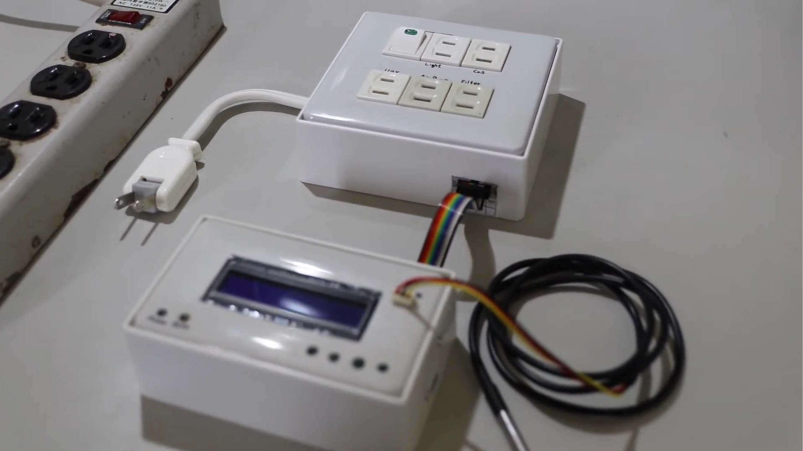
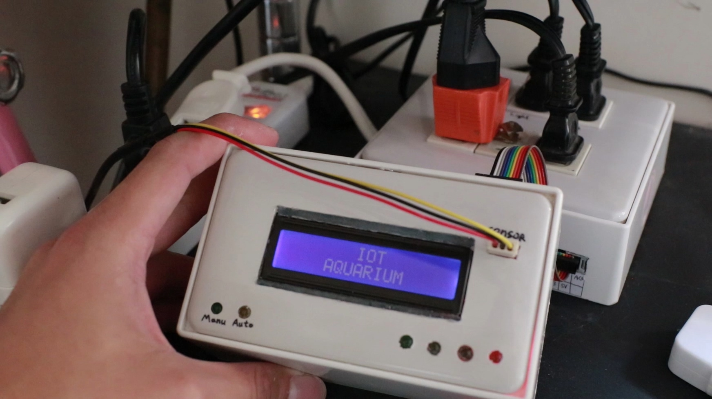
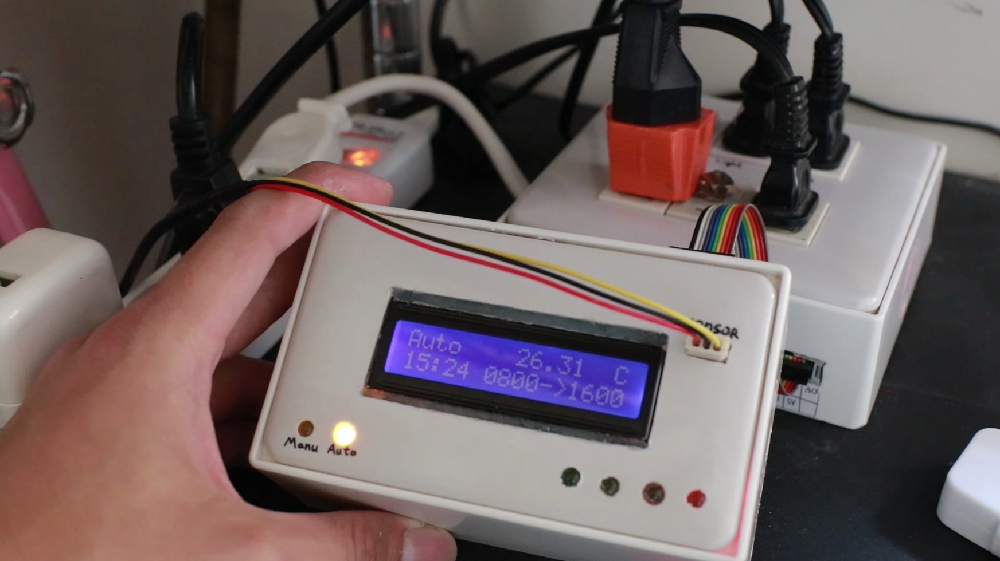

### [- 硬體設備/Hardware](#硬體設備hardware) 

# IOT SmartAquarium

YouTube Link : https://www.youtube.com/watch?v=fPH_UBWnZz8

炎炎夏日，養魚種草的你是否擔心家裡魚缸的溫度會不會過高?
會不會擔心今天會不會太晚下班/下課回家，魚缸的燈忘記關，讓水缸爆藻?

別擔心，有了智慧魚缸控制器，以上困擾再也不會再出現!

使用聯發科 Linkit 7697 與聯發科的MCS雲端沙盒來實作物聯網魚缸，搭配繼電器以及DS18B20溫度感應器，讓你隨時隨地都可以監控魚缸的一切數值。

In a hot summer,are you worried about the temperature is too high for fish or shrimp?
Are you worried when you after work, the light of aquarium had been open too long so the alge growing very quickly?

Now, you have an IOT smart aquarium system, the troubles above will not happen anymore!
This project use Linkit7697 and MCS cloud sandbox service to build a smart IOT Aquarium system,
with relay and DS18B20 temperature sensor, you can monitor the value of your aquarium anytime anywhere!

# 硬體設備/Hardware

1. 1x Linkit 7697

2. 1x 110v轉5V變壓器 或手機充電器 /ac 110v to dc 5v transformer or old phone charger

3. 4x 繼電器(耐壓110V,10A)  /relay 110V/10A

4. 6x 110V插座 /110V ac socket

5. 1x 開關盒/   switch box

6. 1.6 單心銅線/ 1.6mm core copper wire

# 軟體/Software
MCS雲端服務 / MCS introduction
https://mcs.mediatek.com/resources/latest/introduction

Arduino IDE 設定方法/ Arduino IDE Enviorment setup
https://docs.labs.mediatek.com/resource/linkit7697-arduino/en/environment-setup

# 成果/Result
外觀圖片

應用圖片

